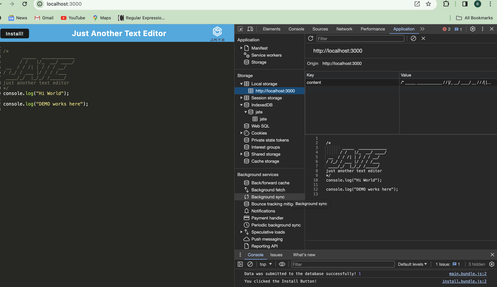
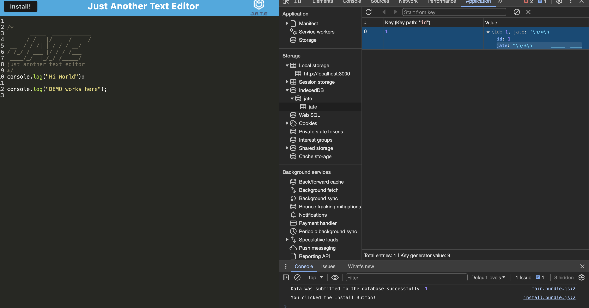

# Effective-PWA-Text-Editor

## Description

To make this a Progressive Web App, you can add a service worker to cache the application's assets for offline access. You'll also need to ensure the application meets other PWA criteria like responsive design, HTTPS usage, and having a manifest file. Additionally, you can enhance the user experience by implementing features like push notifications and background sync.

## Table of Content

1. [Introduction](#introduction)
2. [Features](#features)
3. [Getting Started](#getting-started)

- [Prerequisites](#prerequisites)
- [Usage Guide](#usage-guide)

4. [Contributing to this Project](#contributing-to-this-project)
5. [Reference](#reference)
6. [FAQs](#faqs)

### Introduction

This project is an implementation of a text editor using Progressive Web App (PWA) technology, which allows users to create, edit, save, load, share documents on their devices or online platforms.

This is a simple text editor built using React, Redux, Webpack, Babel, and NodeJS. The purpose of this project is to demonstrate how to build an Effective Progressive Web.

### Features

- JS
- Indexdb
- EXPRESS

### Getting Started

#### Prerequisites:

To run this project, you will need a few prerequisites installed on your system. Please make sure that these are set up before proceeding with the installation steps below: npm install, npm install --save-dev webpack, webpack-dev-server --save-dev, --save-dev webpack-pwa-manifest, babel, followed by idb.

#### Usage Guide:

To start using the text editor, follow these steps:


```
"WHEN I run `npm run start` from the root directory.

THEN I find that my application should start up the backend and serve the client.

WHEN I run the text editor application from my terminal.

THEN I find that my JavaScript files have been bundled using webpack.

WHEN I run my webpack plugins.

THEN I find that I have a generated HTML file, service worker, and a manifest file.

WHEN I use next-gen JavaScript in my application.

THEN I find that the text editor still functions in the browser without errors"


```

_Below is how the Index db functionality works._


Following the usage guide will ensure you are able to use this project successfully. If any issues occur please submit an issue on GitHub with as much detail as possible.

\*The video demonstrates functionally: [Loom](https://www.loom.com/share/0753ed97b33a4e1fb3b866a9eee6d742?sid=c91c8d40-3e24-4177-a05b-55e10d6b9d52)

**The following image shows the application's manifest.json file:**

![[manifest.json]](./images/Screen%20Shot-manifest.png)

- In this manifest file, you can see the name, description, version, and permissions of our app. The "start_url" specifies the URL that will be shown when the user launch.

```
** Create a service worker with workbox that Caches static assets**
In your project folder, create a new file named `service-worker.js`. This file is used to cache your site’s local assets. The code for this service worker is provided below.

```



**Application's IndexedDB storage:**

In this section we will add functionalities to our application’s indexedDB storage. We need to create an object store for notes called "notes", and it must have an auto incrementing id



#### Contributing to this Project

This in contribute to UT Bootcamp 2024-2025

#### Reference

- https://coding-boot-camp.github.io/full-stack/render/render-deployment-guide
- https://github.com/coding-boot-camp/cautious-meme

#### FAQs

Any further questions please don't hesitate to ask or reach out
to me via github at - [@bcot-code](https://github.com/bcot-code/effective-PWA-Text-Editor)
